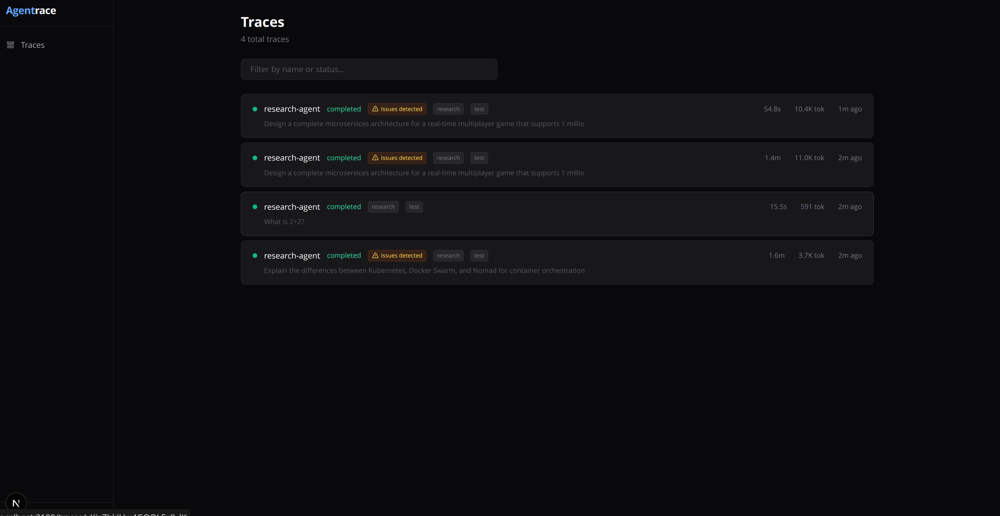
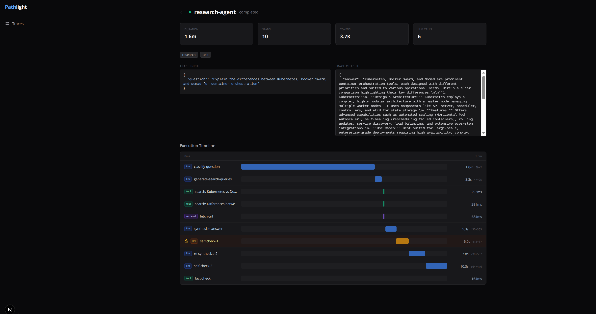
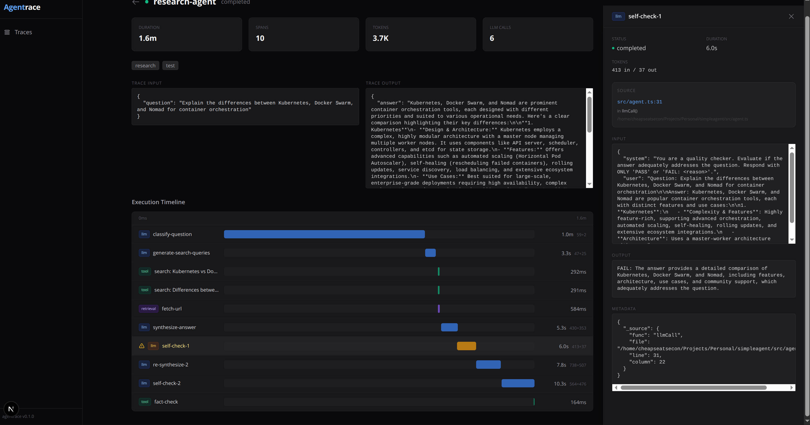

# Agentrace

Visual debugging, execution traces, and observability for AI agents.

When your AI agent makes a bad decision at step 7 of a 12-step workflow, Agentrace shows you exactly what happened — what went in, what came out, how long it took, and where in your code it was called. No more debugging agents with `console.log`.







## Features

- **Waterfall Timeline** — See every step of your agent's execution as a visual timeline with proportional duration bars. LLM calls, tool invocations, retrieval steps — all in one view.
- **Span Inspector** — Click any step to see full inputs, outputs, token counts, model used, and cost. JSON data is formatted and expandable.
- **Automatic Source Mapping** — The SDK captures the exact file, line number, and function name where each span was created. Zero configuration required.
- **Issue Detection** — Spans with failures, errors, or problems are automatically flagged with amber highlights. Traces with issues are marked in the list view so you can spot problems at a glance.
- **Framework Agnostic** — Works with any AI agent, any LLM provider, any framework. Not tied to LangChain, CrewAI, or any specific tool.
- **Self-Hosted** — Your trace data stays on your infrastructure. SQLite database, Docker deploy, no external dependencies.

## Quick Start

```bash
git clone https://github.com/syndicalt/agentrace.git
cd agentrace

npm install

# Generate and run database migrations
npm run db:generate -w packages/db
npm run db:migrate -w packages/db

# Start everything (collector + dashboard)
npx turbo dev
```

- **Collector**: http://localhost:4100 (receives trace data from your agent)
- **Dashboard**: http://localhost:3100 (view and debug traces)

## Instrument Your Agent

Add a few lines to your agent code. The SDK handles the rest.

```bash
npm install @agentrace/sdk
```

```typescript
import { Agentrace } from "@agentrace/sdk";

const tl = new Agentrace({
  baseUrl: "http://localhost:4100",
});

// Start a trace for an agent run
const trace = tl.trace("research-agent", { query: "What is WebAssembly?" });

// Wrap each step in a span
const classifySpan = trace.span("classify", "llm", {
  input: { prompt: "Classify this query..." },
});
const result = await llm.chat("Classify this query...");
await classifySpan.end({
  output: result,
  inputTokens: 50,
  outputTokens: 10,
});

// Tool calls
const searchSpan = trace.span("web-search", "tool", {
  toolName: "search",
  toolArgs: { query: "WebAssembly" },
});
const results = await searchTool("WebAssembly");
await searchSpan.end({ toolResult: results });

// End the trace
await trace.end({ output: finalAnswer });
```

That's it. Open http://localhost:3100 and you'll see the full execution timeline.

## Span Types

| Type | Color | Use For |
|------|-------|---------|
| `llm` | Blue | LLM API calls (chat completions, embeddings) |
| `tool` | Green | Tool invocations (search, code execution, API calls) |
| `retrieval` | Violet | RAG retrieval, document fetching, knowledge base lookups |
| `agent` | Orange | Sub-agent invocations, delegation |
| `chain` | Cyan | Chain/pipeline steps, sequential processing |
| `custom` | Gray | Anything else |

## What You See

### Trace List

All agent runs at a glance. Status indicators (running/completed/failed), duration, token count, and tags. Traces with issues are flagged with an amber warning badge.


### Waterfall Timeline

Every span visualized as a proportional bar showing when it started and how long it took relative to the total trace. Sequential steps cascade down like a waterfall. Issue spans are highlighted in amber.


### Span Inspector

Click any span to open the slide-in panel showing:

- **Status and duration**
- **Model and provider** (for LLM spans)
- **Token counts** (input/output)
- **Source location** — file:line automatically captured from the call stack
- **Input/Output** — formatted JSON
- **Tool arguments and results**
- **Errors**


## Architecture

```
agentrace/
├── packages/
│   ├── collector/    # Hono-based API (port 4100)
│   │   └── src/
│   │       ├── routes/    # REST endpoints for traces, spans, events
│   │       └── router.ts  # CORS, health check, route mounting
│   ├── db/           # Drizzle ORM + SQLite
│   │   └── src/
│   │       └── schema.ts  # traces, spans, events, projects, scores
│   └── sdk/          # TypeScript SDK
│       └── src/
│           └── index.ts   # Agentrace, Trace, Span classes
└── apps/
    └── web/          # Next.js + Tailwind dashboard (port 3100)
        └── src/app/
            ├── page.tsx           # Trace list
            └── traces/[id]/       # Trace detail + timeline
```

## Data Model

| Entity | Description |
|--------|-------------|
| **Trace** | A complete agent execution. Has status, input/output, total duration, tokens, and cost. |
| **Span** | A single step within a trace. Supports nesting via `parentSpanId`. Types: llm, tool, retrieval, agent, chain, custom. |
| **Event** | Point-in-time annotation within a span (logs, decisions, errors). Has severity levels. |
| **Project** | Groups traces. Has an API key for SDK authentication. |
| **Score** | Quality annotation on a trace or span (human or auto-generated). |

## API Endpoints

| Endpoint | Method | Description |
|----------|--------|-------------|
| `/v1/traces` | GET | List traces with filters (status, name, projectId) |
| `/v1/traces` | POST | Create a new trace |
| `/v1/traces/:id` | GET | Get trace with all spans, events, and scores |
| `/v1/traces/:id` | PATCH | Update trace (status, output, duration) |
| `/v1/traces/:id` | DELETE | Delete trace and all related data |
| `/v1/spans` | POST | Create a span |
| `/v1/spans/:id` | PATCH | Update span (status, output, tokens, cost) |
| `/v1/spans/:id/events` | POST | Log an event within a span |
| `/v1/projects` | GET | List projects |
| `/v1/projects` | POST | Create a project (returns API key) |
| `/health` | GET | Health check |

## SDK Reference

### `Agentrace`

```typescript
const tl = new Agentrace({
  baseUrl: "http://localhost:4100",  // Collector URL
  projectId: "my-project",           // Optional project grouping
  apiKey: "tl_...",                   // Optional authentication
});
```

### `Trace`

```typescript
const trace = tl.trace("agent-name", inputData, {
  tags: ["production", "v2"],
  metadata: { userId: "123" },
});

// ... run your agent ...

await trace.end({ output: result });
// or
await trace.end({ status: "failed", error: "Something went wrong" });
```

### `Span`

```typescript
const span = trace.span("step-name", "llm", {
  model: "gpt-4o",
  provider: "openai",
  input: { prompt: "..." },
  toolName: "search",        // for tool spans
  toolArgs: { query: "..." }, // for tool spans
});

await span.end({
  output: result,
  inputTokens: 100,
  outputTokens: 200,
  cost: 0.003,
  toolResult: { ... },       // for tool spans
});

// Log events during execution
await span.event("decision", { choice: "retry" }, "info");
```

Source location (file, line, function) is captured automatically when a span is created.

## Environment Variables

| Variable | Default | Description |
|----------|---------|-------------|
| `DATABASE_URL` | `file:agentrace.db` | SQLite or Turso connection URL |
| `DATABASE_AUTH_TOKEN` | — | Turso auth token (if using Turso) |
| `PORT` | `4100` | Collector port |
| `DASHBOARD_URL` | `http://localhost:3100` | Dashboard URL (for CORS) |
| `NEXT_PUBLIC_COLLECTOR_URL` | `http://localhost:4100` | Collector URL (browser-side) |

## Tech Stack

- **Collector**: [Hono](https://hono.dev) (lightweight, fast)
- **Dashboard**: [Next.js](https://nextjs.org) + [Tailwind CSS](https://tailwindcss.com)
- **Database**: SQLite via [Drizzle ORM](https://orm.drizzle.team)
- **Monorepo**: [Turborepo](https://turbo.build)

## License

MIT
